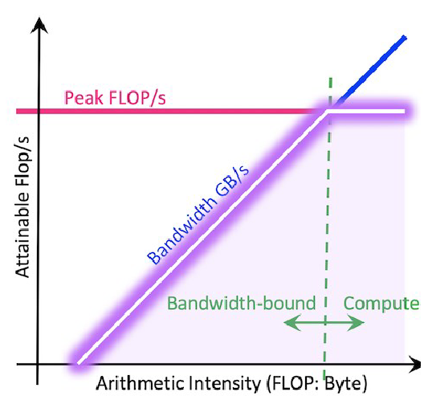

# Calcolo delle prestazioni

La valutazione complessiva delle prestazioni di un sistema informatico si basa su diversi fattori: 

- Il **tempo** necessario per completare un compito
- La quantità di **risorse informatiche** impiegate
- L'**energia** consumata nel processo

Le prestazioni di un sistema sono quindi influenzate sia dalle caratteristiche dell'hardware in uso sia dalla qualità del software implementato. Ogni componente hardware, come le unità di elaborazione (CPU e GPU), la memoria o la rete, contribuisce in modo significativo all'efficienza generale del sistema.

Dal lato software, gli algoritmi utilizzati e la gestione dei dati giocano un ruolo cruciale, così come la capacità del software di sfruttare appieno le risorse hardware disponibili (**hardware exploitation**). 

È importante definire due concetti fondamentali:

1. **Theoretical Peak Performance**: si tratta di una valutazione **teorica** "massima" delle prestazioni di un componente hardware, basata sulle sue specifiche tecniche

2. **Sustained Performance (Throughput)**: rappresenta le prestazioni **effettive** (misurate) di un componente hardware o di un intero sistema durante l'esecuzione di programmi di benchmark

## CPU

Le prestazioni di una CPU sono essenzialmente misurate dalla sua capacità di eseguire operazioni in un determinato lasso di tempo. Tradizionalmente, questo veniva valutato contando tutte le istruzioni elaborate dal processore e utilizzando come metrica i **MIPS** (Milioni di Istruzioni al Secondo). Tuttavia, con l'evoluzione della tecnologia, l'attenzione si è spostata verso le operazioni in virgola mobile, che sono ora il criterio principale per misurare le prestazioni. Queste vengono espresse in **MFLOPS** (Milioni di Operazioni in Virgola Mobile al Secondo) o **GFLOPS** (Miliardi di Operazioni in Virgola Mobile al Secondo)

In particolare, la massima teorica capacità di elaborazione (Theoretical Peak Performance) di un core di calcolo, è calcolata moltiplicando il numero di cicli di clock per secondo (espressi in Hertz) per il numero di operazioni in virgola mobile che il core è in grado di completare in un singolo ciclo di clock. 

La formula per determinare le FLOPS (Floating Point Operations Per Second) è quindi: 

$$\text{FLOPS} = \text{Clock (Hz)} \cdot \text{FLOPs/cycle}$$

##### **Theoretical Peak Performance**

Il concetto di Theoretical Peak Performance nelle CPU moderne è strettamente legato all'uso di istruzioni vettoriali, come quelle **SIMD** (Single Instruction, Multiple Data), e alle istruzioni **FMA** (Fused Multiply-Add). Queste tecnologie consentono ai processori di eseguire operazioni su più dati contemporaneamente, incrementandone notevolmente l'efficienza, specialmente in applicazioni che richiedono intensivi calcoli matematici, come le operazioni vettoriali.

I processori Intel e AMD hanno integrato nei loro design avanzati set di istruzioni SIMD, sfruttando registri dedicati per eseguire istruzioni in virgola mobile su diversi dati in parallelo. Inoltre, dal momento che le operazioni ad alto impatto computazionale sono spesso delle moltiplicazioni tra matrici, è stata aggiunta una ulteriore istruzione dedicata, **FMA**, che in un solo ciclo di clock esegue due operazioni, somma e moltiplicazione.
## Memoria

La gerarchia della memoria in un sistema informatico gioca un ruolo cruciale nel determinare l'efficienza complessiva delle prestazioni. Questa gerarchia è progettata per bilanciare costo, capacità e velocità, disponendo diversi livelli di memoria in base alla loro velocità di accesso e al loro costo per bit. Dal più veloce al più lento, i principali livelli includono:

1. **Registri del processore**: si trovano all'interno della CPU stessa e offrono i tempi di accesso più rapidi possibili. Tuttavia, la loro capacità è estremamente limitata.
2. **Cache**: divisa in più livelli (L1, L2, e talvolta L3), la cache è più rapida della memoria RAM principale e si trova vicino al processore per minimizzare i tempi di accesso. Ogni livello di cache ha una capacità maggiore e tempi di accesso leggermente più lunghi rispetto al livello precedente.
3. **Memoria Principale (RAM)**: più lenta rispetto ai registri e alla cache, ma offre una capacità molto maggiore, essendo il principale spazio di lavoro per il processore.
4. **Storage di massa (SSD, HDD)**: pur offrendo la maggiore capacità di memorizzazione, gli hard disk (HDD) e, in misura minore, le unità a stato solido (SSD), presentano i tempi di accesso più lunghi. Sono utilizzati per conservare dati e programmi non immediatamente necessari in memoria.

La memoria può diventare un collo di bottiglia nelle prestazioni di un sistema se non è in grado di fornire dati al processore con la velocità richiesta. L'ottimizzazione della gerarchia della memoria è quindi critica per migliorare le prestazioni complessive del sistema

---
##### RoofLine Analysis

L'analisi Roofline è un modello visivo utilizzato per valutare le prestazioni di un kernel computazionale, identificando in modo intuitivo i colli di bottiglia legati sia alla CPU/GPU sia alla memoria di un sistema. Questo modello grafico mette in relazione la capacità di calcolo di un dispositivo (misurata in FLOP/s) con la larghezza di banda della memoria, permettendo di determinare se le prestazioni sono limitate dalla velocità di elaborazione o dalla capacità di movimentazione dei dati.

Nel modello Roofline, la formula per calcolare i FLOP/s è data da: 

$$ \text{FLOP/s} = \min(\text{peak FLOP/s}, \text{Peak Memory Bandwidth} \cdot \text{Arithmetic Intensity})$$

Dove:

- **Peak FLOP/s** rappresenta la massima teorica performance di calcolo della CPU o GPU, ovvero quante operazioni in virgola mobile può eseguire per secondo al massimo della sua capacità

- **Peak Memory Bandwidth** indica la massima larghezza di banda della memoria, ovvero la massima quantità di dati che possono essere trasferiti tra la memoria e la CPU/GPU per secondo

- **Arithmetic Intensity** è definita come il rapporto tra il numero di operazioni in virgola mobile (FLOPS) e la quantità di dati trasferiti (in byte), ossia quante operazioni possono essere eseguite per ogni byte di dati trasferiti. Questo parametro è cruciale per comprendere l'efficienza computazionale di un kernel, poiché valuta l'equilibrio tra calcolo e trasferimento dati

Il grafico Roofline rappresenta sulle ordinate la capacità di calcolo (FLOP/s) e sulle ascisse l'intensità aritmetica. Due "tetti" dominano il grafico: il primo è la massima performance di calcolo (Peak FLOP/s), e il secondo è il prodotto della larghezza di banda della memoria per l'intensità aritmetica. L'intersezione tra queste due metriche determina il limite teorico delle prestazioni per un dato kernel.

Questa analisi consente agli sviluppatori di identificare se un'applicazione è "CPU-bound" (limitata dalla capacità di calcolo) o "memory-bound" (limitata dalla larghezza di banda della memoria)

---
##### Storage nei sistemi HPC

Nei sistemi di High Performance Computing (HPC), la gestione efficiente dello storage è fondamentale per garantire prestazioni ottimali. Tipicamente, lo storage è organizzato in tre livelli principali:

**Hot Tier**

Il Hot tier è progettato per i dati che vengono utilizzati frequentemente, e che richiedono le prestazioni più elevate in termini di velocità di lettura/scrittura. Questo livello utilizza tecnologie di storage ad alta velocità, come SSD (Solid State Drives) o storage su RAM, che offrono tempi di accesso molto bassi. La capacità di questo livello è generalmente limitata a causa del costo elevato di queste tecnologie

**Warm Tier**

Il Warm tier è destinato ai dati che vengono utilizzati meno frequentemente. Questo livello fornisce un buon equilibrio tra costi, capacità e prestazioni, utilizzando tecnologie di storage come dischi rigidi più veloci (HDD) o SSD di capacità maggiore ma con prestazioni leggermente inferiori rispetto a quelli utilizzati nel hot tier

**Cold Tier**

Infine, il Cold tier è dedicato alla memorizzazione a lungo termine dei dati che vengono utilizzati raramente. Questo livello enfatizza la capacità di storage su vasta scala a scapito delle prestazioni, utilizzando soluzioni di storage economiche come nastri magnetici o HDD ad alta capacità ma a basso costo

##### SAN (Storage Area Network)

Una Storage Area Network (SAN) è un tipo di rete è progettata per connettere tra loro dispositivi di memorizzazione di massa attraverso una rete ad alta velocità dedicata.

**Vantaggi delle SAN**

- **Prestazioni**: Grazie alla rete ad alta velocità e al design dedicato, le SAN offrono prestazioni elevate in termini di velocità di trasferimento dati e accesso allo storage
  
- **Scalabilità**: Le SAN permettono di aggiungere facilmente dispositivi di storage o di espandere la capacità esistente senza interrompere i servizi
  
- **Ridondanza**: Grazie alla possibilità di implementare diverse soluzioni di ridondanza e backup, le SAN assicurano una maggiore protezione dei dati contro guasti hardware e disastri, minimizzando i tempi di inattività

Tuttavia, configurare e mantenere una SAN richiede competenze specifiche e una gestione attenta e comporta costi significativi, non solo per l'acquisto dell'hardware e del software necessari, ma anche per la manutenzione e la gestione dell'infrastruttura

## File System per cluster HPC

Un file system progettato per un cluster HPC deve possedere particolari caratteristiche per gestire efficientemente i dati e ottimizzare le prestazioni. In particolare, il file system deve essere:

- **Condiviso (shared)** : Diversi nodi possono accedere direttamente e contemporaneamente ai dischi condivisi, migliorando l'efficienza e la velocità di elaborazione.

- **Clusterizzato (clustered)**: Tutti i dischi devono essere accessibili e utilizzabili in simultanea da ogni nodo del cluster, consentendo una distribuzione uniforme del carico di lavoro e un'ottimizzazione delle risorse disponibili.

- **Parallelo (parallel)**: I singoli file vengono suddivisi in blocchi, i quali vengono poi distribuiti (striping) su tutti i dischi del sistema. Questa strategia permette un accesso e una lettura parallela dei dati, accelerando significativamente le operazioni su file di grandi dimensioni

Deve inoltre supportare: 

- **Byte Range Locking**: Questa tecnica consente a più utenti di accedere contemporaneamente allo stesso file senza conflitti

- **Tiering**: Questo tecnica consiste nel creare una gerarchia di livelli di storage, ognuno con differenti caratteristiche di prestazione. Permette cioè di organizzare i dati in base alla frequenza di accesso o alla loro importanza

## Network

Le reti ad alta velocità giocano un ruolo cruciale nei moderni ambienti di High Performance Computing (HPC), data center, e infrastrutture IT, dove la necessità di trasferire grandi volumi di dati rapidamente è fondamentale. **Intel Omni-Path**, **InfiniBand EDR** e le varianti di **Ethernet** a 10 Gb e 1 Gb sono esempi prominenti di tecnologie di rete progettate per soddisfare queste esigenze.

## Benchmark

I **benchmark** sono strumenti essenziali nell'ambito dell'informatica per valutare le prestazioni reali (sustained performance) di sistemi di calcolo attraverso una serie di test software standardizzati. Questi test misurano come i computer eseguono diverse operazioni, fornendo una base di confronto oggettiva tra diversi hardware e configurazioni di sistema. Due dei più noti e utilizzati benchmark nel settore sono i test **SPEC CPU** e **LINPACK**.

